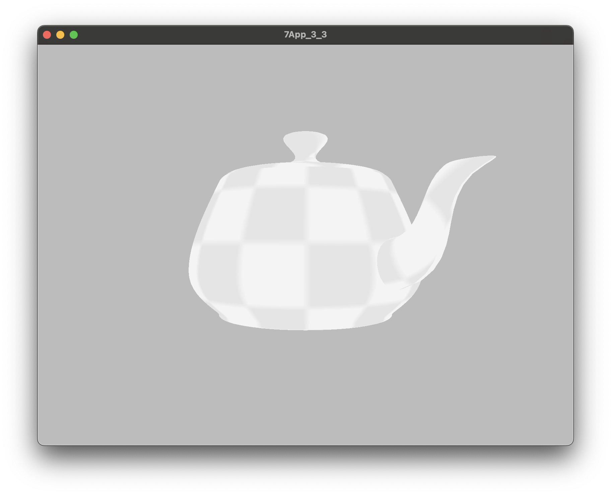
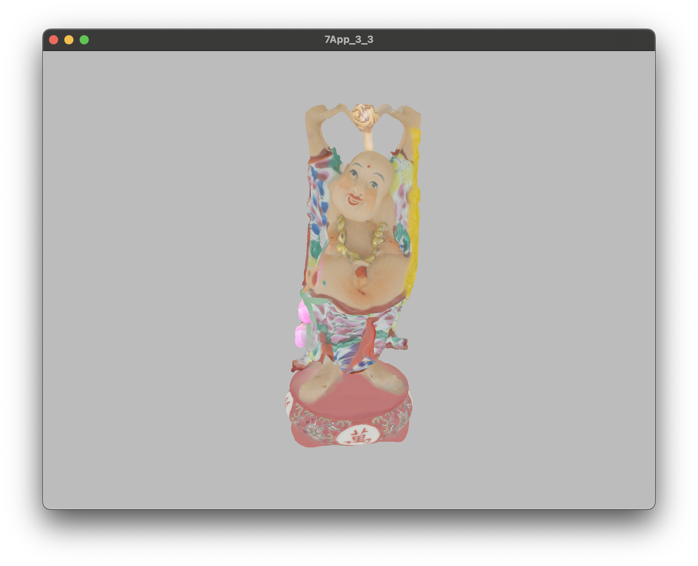
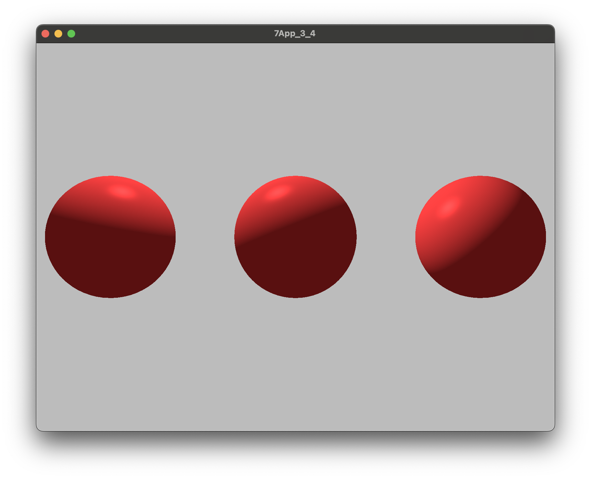

# Bonus: camera rotation
I implemented camera rotation based on mouse input, this can be seen in the Part 3 videos.


# Bonus: textures
I implemented textures for the scenes *teapot*, *bunny*, *buddha*, and *untitled*. My code looks at which scene is being rendered and chooses the appropriate texture. Use `-textures` to enable textures.


`./balboa -hw 3_3 ../scenes/hw3/teapot.json -textures -nomove`


`./balboa -hw 3_3 ../scenes/hw3/buddha.json -textures -nomove`



# Bonus: lighting animation
I implemented lighting animation with command line arguments

Example:
```sh
./balboa -hw 3_4 ../scenes/hw3/teapot.json -directional 0 0 1 0 0 1 0.5 -directional -1 0 0 0 1 0 0.5 -directional 0 -1 0 1 0 0 0.5 -animate 2 0 1 -animate 1 1 1
```
[outputs/hw_3_4_animation_teapot.mov](outputs/hw_3_4_animation_teapot.mov)

Breakdown:
- `-directional  0  0 1 0 0 1 0.5` creates a directional light with direction=(0,0,1) color=(0,0,1) specularStrength=0.5
- `-directional -1  0 0 0 1 0 0.5` creates a directional light with direction=(-1,0,0) color=(0,1,0) specularStrength=0.5
- `-directional  0 -1 0 1 0 0 0.5` creates a directional light with direction=(0,-1,0) color=(1,0,0) specularStrength=0.5
- `-animate 2 0 1` moves the light at index 2 according to style 0 with speed=1
- `-animate 1 1 1` moves the light at index 1 according to style 1 with speed=1

Animate command argument:
```sh
-animate <light index> <style> <speed>
```
Each light has an index corresponding to their order, starting with the first light being index 0. The speed is just a constant to be multiplied to the time for each update of the light.

Styles:
- `0` rotates the XY of a light's direction
- `1` rotates the XZ of a light's direction
- `2` rotates the XY of a light's position
- `3` rotates the XZ of a light's position
- `4` rotates the YZ of a light's direction up and down by a small amount


# Bonus: different types of lights
I implemented up to 16 lights being in a scene at once, all with type directional, point, or spot.

Example:
```sh
./balboa -hw 3_4 ../scenes/hw3/buddha.json -textures -directional 1 0 0 0 0 1 0.5 -animate 0 1 1 -point 0 -1 0 0 1 0 0.5 -animate 1 2 2 -spot 0 -300 -800 0 0 1 1 1 1 0.5 4 10 -animate 2 4 1 -nomove
```
[outputs/hw_3_4_lights_buddha.mov](outputs/hw_3_4_lights_buddha.mov)

Breakdown:
- `-directional 1 0 0 0 0 1 0.5` creates a directional light with direction=(1,0,0) color=(0,0,1) specularStrength=0.5
- `-point 0 -1 0 0 1 0 0.5` creates a point light with position=(0,-1,0) color=(0,1,0) specularStrength=0.5
- `-spot 0 -300 -800 0 0 1 1 1 1 0.5 4 10` creates a spot light with position=(0,-300,-800) direction=(0,0,1) color=(1,1,1) specularStrength=0.5 cutoff=4 outerCutoff=10

Light command argument:
```sh
-directional           <direction XYZ> <color RGB> <specular strength>
-point  <position XYZ>                 <color RGB> <specular strength>
-spot   <position XYZ> <direction XYZ> <color RGB> <specular strength> <cutoff> <outer cutoff>
```

To better show off point light:
```sh
./balboa -hw 3_4 ../scenes/hw3/spheres.json -point 2 5 0 1 1 1 1.0 -nomove
```



# Part 5: my own scene  +  Bonus: shadow mapping
I implemented basic shadow mapping with directional light. The shadow mapping is best demonstrated in my own scene `untitled.json`
```sh
./balboa -hw 3_4 ../scenes/hw3/untitled.json -textures -directional -1 2 -1 1 1 1 2 -shadow 0 -flat
```
Screenshots can be found at `outputs/hw_3_5_1.png` and `outputs/hw_3_5_2.png`

Shadow command argument:
```sh
-shadow <light index>
```
Light index is which light's direction to use when rendering the shadow map.


## Part 5: scene credit
The minecraft world was downloaded from ([https://casual-effects.com/data/](https://casual-effects.com/data/)) and export to PLY was done by me in Blender.

    Neu Rungholt medieval village Minecraft map
    (stylized recreation of the real city, http://en.wikipedia.org/wiki/Rungholt)
    entitled "Alone in the dark" by "kescha"
    http://www.planetminecraft.com/project/neu-rungholt/
    "Fell[sic] free to use the map or parts of it for you own projects. "

    6,704,264 faces
    12,308,528 vertices 
    after loading and welding colocated vertices

    ------------------
    Converted to OBJ by Morgan McGuire using Mineways (http://mineways.com)

Files added: `scenes/hw3/untitled.json` and `scenes/hw3/untitled.ply`

